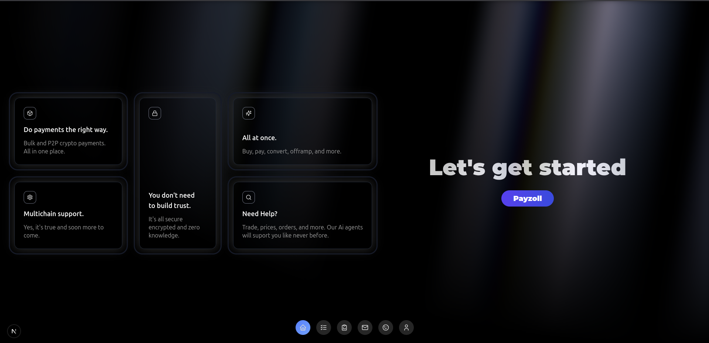
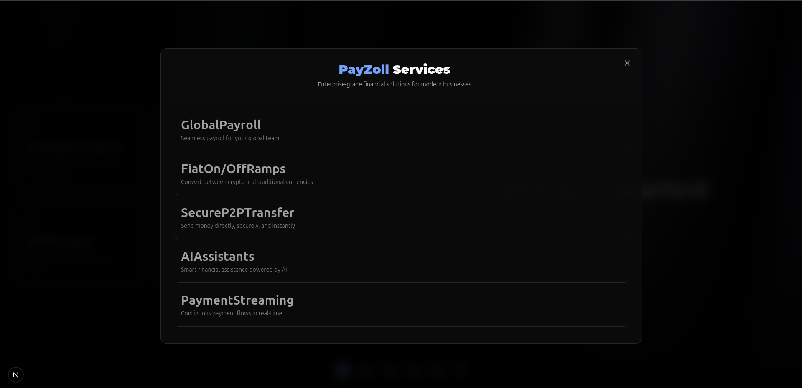
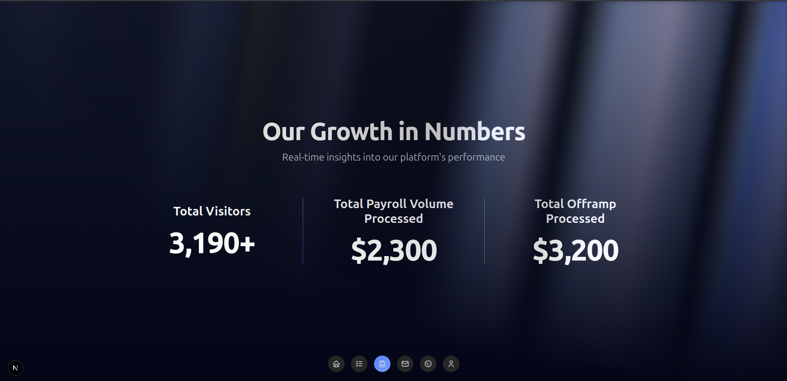

# Payzoll - Web3 Native Financial Infrastructure

> PayZoll is your all-in-one financial umbrella, seamlessly blending decentralized and centralized rails into a single, turnkey ecosystem. From on-chain smart-contract payroll, streaming payments, and trustless P2P transfers, to fiat on-ramps/off-ramps, KYC/AML compliance, and AI-powered automation, PayZoll empowers businesses and individuals with the full spectrum of Web3-native and traditional finance services—secure, scalable, and future-proof.

---


## 🌍 Vision & Alignment with Pharos

## Pharos Vision  

Pharos Network’s mission is to **bridge TradFi and DeFi** by providing:  

- **Ultra-High Throughput** (50k TPS, lesst than 1s block times) via its Pharos VM and parallel execution layers;  
- **Institution-Grade RWA Support** with on-chain credit networks, zk-attested identities, and native tokenization pipelines;  
- **Special Processing Networks (SPNs)** for customizable, low-latency environments tailored to payments, AI, HFT, and privacy use-cases;  
- **EVM-Compatibility & Interoperability**, unlocking seamless migration of Ethereum dApps and tooling onto a truly Web3-native settlement layer 

---

## Payzoll Vision  

Payzoll unifies TradFi and DeFi into one **Web3-native financial umbrella**, offering:  

- **Secure Payments, Streams** transfer whatever you want to whoever you want;
- **On-chain Payroll** with gas abstraction, multi-token payroll and real-time streaming;  
- **Trustless P2P Transfers** with built-in recovery and dispute resolution;  
- **Fiat On/Off-Ramps** tightly integrated for seamless fiat-crypto flows;  
- **AI-Driven Automation** agents for recurring disbursements and compliance checks;  
- **zk-KYC & Anonymous Auth** for privacy-preserving, on-chain identity and data storage.  
- **Abstraction** finance running on web3 with the feel of traditionality;

---

## Perfect Alignment  

- **Inclusive Payment Rails**: Pharos’ sub-second finality and 50k TPS throughput power Payzoll’s gas-abstracted payroll and micro-streaming services at scale.
- **RWA & Liquidity**: Pharos’ native RWA tooling and credit networks complement Payzoll’s tokenized payroll and stablecoin distributions, ensuring deep liquidity and compliance.
- **Composable Superapps**: Leveraging SPNs and Pharos VM’s parallelism, Payzoll can modularly deploy payroll, streaming, compliance, analytics, and DAO governance under one unified ecosystem.
- **TradFi-to-Web3 Convergence**: Both Pharos and Payzoll share a commitment to seamlessly onboard traditional finance into the blockchain era. Pharos delivers institutional-grade RWA tooling, on-chain credit networks, zk-attested identities, and ultra-high throughput settlement, while Payzoll provides fully compliant payroll, fiat on/off-ramps, KYC/AML workflows, and familiar UX abstractions—together creating an end-to-end migration path for banks, enterprises, and everyday users to adopt decentralized rails without compromising on performance, security, or regulatory requirements.

Together, Pharos and Payzoll drive **trustless innovation**, **financial inclusion**, and **mass adoption** by seamlessly connecting traditional finance rails with decentralized settlement, enabling real-world payroll, payments, and asset management at Internet scale.  

---

## 🧠 What is PayZoll ?

Payzoll is a **fully modular Web3 payment infrastructure** built to meet the needs of both crypto-native projects and traditional Web2 enterprises. Our end-to-end vision is to provide every piece of the financial lifecycle—from on-chain asset acquisition all the way through to fiat settlements—in a single, one-click experience that feels as familiar as your favorite payment app.

### Core Modules

- **Payroll**  
  Automated, gas-abstracted disbursements that work on-chain or off-chain, eliminating manual overhead and ensuring employees get paid on time in the token of their choice.

- **Streaming Payments** *(Upcoming)*  
  Real-time money flows for freelancers, DAOs, and distributed teams—no more batch cycles or waiting periods, just continuous value transfer whenever and wherever it’s needed.

- **Secure P2P Transfers**  
  Trust-minimized, recoverable person-to-person transfers with built-in dispute resolution and recovery options, making peer payments reliable and user-friendly.

- **Fiat On/Off-Ramps**  
  Seamless integration with banking rails and fiat bridges—move money in and out of crypto with a single click, backed by institutional liquidity and compliance.

- **AI-Powered Agents (partial and upcoming )**  
  Smart, on-chain bots that automate recurring workflows—payroll runs, subscription billing, compliance checks—so you can focus on growth, not grunt work.

- **zk-KYC & Anonymous Auth** *(Planned)*  
  Privacy-preserving, zero-knowledge identity and data storage that meets regulatory requirements without exposing sensitive user information.


---

### One-Click, End-to-End UX

Our ultimate mission is to onboard traditional businesses into Web3 without friction:

1. **Crypto Acquisition**  
   Instantly purchase stablecoins or native tokens directly through embedded fiat rails.

2. **On-Chain Processing**  
   Trigger payroll, streams, or P2P transfers via a simple dashboard or API call—no manual gas management needed.

3. **Compliance & Reporting**  
   Built-in KYC/AML workflows and audit trails ensure you stay on the right side of regulations.

4. **Fiat Settlement**  
   Automatically convert on-chain balances to local currency and settle directly to bank accounts, all with one confirmation.

By abstracting complexity and unifying centralized and decentralized rails, Payzoll makes advanced Web3 finance feel like a button click—empowering enterprises, startups, and everyday users to transact globally with confidence and ease.

---

## Accomplishments

- 🚀 **Multi-Mainnet Deployments**: Live on **BNB Chain**, **Arbitrum**, **Polygon**, and **Aptos**  
- 👥 **Pilot Success**: Completed real-world payroll for **2 pilot users**  
- 🏆 **Hackathon Victories**:  
  - Winner – **ETHIndia Hackathon**  
  - Winner – **BNB Chain Hackathon Q4**  
  - Winner – **Stellar Build Hackathon**  
- 🎓 **Incubation & Acceleration**: Selected for **EduChain OpenCampus** incubation program  
- 🔄 **On-Chain Transactions**: Processed real P2P transfers and fiat offramp transactions on mainnet


---

## 📈 Strategic Roadmap & Execution Plan

To ensure transparency and clarity for stakeholders, we’ve broken down our roadmap into quarterly milestones, each accompanied by high-level objectives and a visual Gantt timeline. This plan balances rapid delivery of core modules with rigorous compliance, user experience enhancements, and ecosystem partnerships.

---

### 🚀 High-Level Gantt Timeline

```mermaid
gantt
    title Payzoll Strategic Roadmap
    dateFormat  YYYY-MM-DD
    section Q1 2025 (Completed)
    Payroll Core Contract           :done,    2025-01-05, 2025-02-15
    Offramp Integrations (partial)  :done,    2025-02-10, 2025-03-20
    P2P Transfer Layer              :done,    2025-01-20, 2025-03-05
    Frontend MVP (Next.js)          :done,    2025-01-15, 2025-03-25
    Multi-Mainnet Deployment        :done,    2025-02-01, 2025-03-30

    section Q2 2025 (In Progress)
    Streaming Payments              :active,  2025-04-01, 2025-06-30
    Full Offramp Fulfillment        :active,  2025-04-15, 2025-06-30
    AI On-Chain Agents v2           :active,  2025-05-01, 2025-06-30
    zkKYC & Decentralized Auth      :active,  2025-05-15, 2025-07-15
    Decentralized Storage & Security:active,  2025-06-01, 2025-07-30
    Analytics & Reporting Dashboard :active,  2025-04-15, 2025-06-20

    section Q3 2025 (Planned)
    DAO-Based Payroll Governance    :         2025-07-01, 2025-09-30
    Multi-Chain Treasury Management :         2025-07-15, 2025-10-15
    Web3-Enabled Accounting System  :         2025-08-01, 2025-10-30
    Global Compliance Framework     :         2025-08-15, 2025-11-15
    On-Ramp Abstraction MVP         :         2025-09-01, 2025-11-30
    Strategic DEX Partnerships      :         2025-09-15, 2025-12-15
````

---

### 🎯 Quarterly Objectives & Key Results

| Quarter     | Objective                                     | Key Results                                                                                                                                                                      |
| ----------- | --------------------------------------------- | -------------------------------------------------------------------------------------------------------------------------------------------------------------------------------- |
| **Q1 2025** | Establish Core Payment Infrastructure         | • Payroll contract audited and live<br>• Partial offramp integration with 2+ fiat partners<br>• P2P layer handling >100 tx/day                                                   |
| **Q2 2025** | Scale Feature Set and Compliance              | • Real-time streaming MVP deployed<br>• Full end-to-end offramp flow (on-ramp → on-chain → off-ramp)<br>• zkKYC proof-of-concept<br>• Analytics dashboard with metrics       |
| **Q3 2025** | Governance, Treasury, and Ecosystem Expansion | • DAO governance module with treasury controls<br>• Multi-chain treasury deployed on 3 networks<br>• Global compliance playbook published<br>• 2 strategic DEX integrations live |

---

### 🛠️ Roadmap Execution Flow

```mermaid
flowchart LR
    subgraph Q2 2025 In-Progress
      SP[Streaming Payments] --> OF[Full Offramp Fulfillment]
      SP --> AI[AI Agents v2]
      AI --> KYC[zkKYC & Auth]
      KYC --> DS[Decentralized Storage]
      DS --> AD[Analytics Dashboard]
    end

    subgraph Q3 2025 Planned
      GOV[DAO Governance] --> TM[Treasury Management]
      TM --> AC[Accounting System]
      AC --> GC[Global Compliance]
      GC --> OR[On-Ramp Abstraction]
      OR --> DX[DEX Partnerships]
    end

    SP --> GOV
```

---

### ✍️ Notes

- **Milestone Dependencies**

  - Streaming Payments builds on the P2P layer and on-chain token registry from Q1.
  - Full offramp fulfillment requires both smart-contract integrations and banking partnerships.
  - zkKYC & decentralized storage are prerequisites for our Global Compliance Framework in Q3.

- **Quality & Compliance**

  - Each deliverable undergoes a two-step security audit and automated compliance testing.
  - We maintain continuous monitoring to ensure sub-second finality and >99.9% uptime.

- **Stakeholder Engagement**

  - Monthly status updates with demos for pilot partners.
  - Quarterly Town Halls to gather feedback from enterprise and community users.

---

### Modular Infrastructure

- **Smart Contracts** (Solidity + Move): Payroll, P2P, Token Registry, Streaming
- **AI Agent Layer**: Automated task execution (Gelato + LLM based)
- **Frontend**: Built with Next.js, Tailwind, and Framer Motion
- **Backend**: Node.js + Express for off-chain integrations
- **Compliance**: zkKYC (Planned), secure off-chain auth, encrypted metadata

---

## 💡 Why Payzoll?

| Capability                     | Status      | Description                                                                 |
|-------------------------------|-------------|-----------------------------------------------------------------------------|
| Payroll System                | ✅ Live      | Disburses funds with gas abstraction, supports real tokens                 |
| P2P Payments                  | ✅ Live      | Secure, recoverable and fast                                                |
| Offramp Support               | ✅ Live      | Fiat settlements and partner integration                                   |
| AI Agents                     | 🟡 Partial   | Automate reminders, transfers, and streams                                 |
| zk-KYC & Auth Layer           | 🟠 Planned   | Fully compliant yet private identity and login system                      |
| DAO Governance (Payroll Ops) | 🔵 Upcoming  | Manage treasury and distribution logic via DAO                             |

---

## 📣 Community, Marketing & Ecosystem

- **Featured By**: BNB Chain, Stellar, ETHIndia — highlighted in official blogs, hackathon recaps, and ecosystem spotlights.  
- **Multi-Chain Engagement**: Thriving developer and user communities across BNB Chain, Arbitrum, Polygon, Aptos, and Stellar.  
- **Active Social Presence**: Regular updates, AMAs, and product walkthroughs on Twitter, LinkedIn, and Telegram.  
- **Telegram Community**: A rapidly growing group, collaborating on feature requests, troubleshooting, and real-time support.  
- **Web3 Events & Podcasts**: Hosted deep-dive demos and Twitter Spaces alongside community events.  
- **DAO-Powered Contributor Network** (planned): Empowering global contributors—developers, designers, and strategists—through grants, hackathon sponsorships, and governance proposals.  
- **Strategic Partnerships**: Seamless integrations and co-marketing with BNB Chain, Stellar, Alchemy, Chainlink, and ETHIndia ecosystem partners to amplify reach and UX.  

---

## Team & Expertise

Our team combines deep expertise in blockchain technology and End to End product and business development.

## Abhinav

Cofounder @PayZoll | B.tech CSE from IIIT Guwahati | End to End Dev@ MERN/ Next, Nest , Blockchain Dev @solidity, move, rust | Contract Audit and Security | Lead Developer

**Core Contributions & Timeline**  

- **Q3 2024** – **Aptos Build**: Architected and shipped the Aptos integration module, including on-chain payroll contracts and multi-token support.  
- **Q4 2024** – **Stellar Build**: Led development of the Stellar smart-contract suite (bulk transfers, multi-hop swaps) and front-end integration using Rust SDK & Freighter.  
- **Q1 2025** – **Payroll & Offramp Protocols**: Designed and deployed the gasless payroll engine, complete fiat on/off-ramp flow, and backend services (Node.js + Express).  
- **Ongoing** – **Full-Stack Development**: Overseeing Next.js + Tailwind frontend, NestJS APIs, smart-contract audits, and cross-chain orchestration.  

> **Tech Stack:** Solidity, Move, Rust, MERN (Next.js, React, Node.js), NestJS, Automations, Chainlink Oracles  

## Vaibhav

Founder @PayZoll | B.tech in Computer Science & Engineering from IIIT Guwahati | Proven Entrepreneurial Leader: Successfully managed North-East India operations for an e-commerce startup, leading a team of 100+ and achieving 6-figure monthly sales.

**Core Contributions & Timeline**  

- **Ongoing** – **Business Development**

---

## Sarthak Bansal

Founding Engineer@ PayZoll | B.tech in Computer Science & Engineering from IIIT Guwahati |
Lead Backend Engineer, Web3 Developer

**Core Contributions & Timeline**  

- **Ongoing** – **Backend Development** , **P2P Protocol Development**

> **Tech Stack:** Solidity, Node.js, MERN,Auditing and Security
---

## Why Payzoll Excels Across Key Evaluation Areas

### Team Expertise  

Our leadership combines top-tier blockchain development, full-stack engineering, and enterprise product management. Abhinav’s multi-chain smart-contract builds (Aptos, Stellar) and end-to-end frontend/backend delivery, Vaibhav’s proven track record in strategic partnerships and growth, and Sarthak’s design of a secure, recoverable P2P protocol demonstrate the depth and diversity of our skill set.

### Ecosystem Alignment & Contribution  

Payzoll directly leverages Pharos’ ultra-high throughput, sub-second finality, and RWA tooling to deliver inclusive payment rails, tokenized payroll, and compliant identity layers. Our modular architecture and on/off-chain bridges amplify Pharos’ vision—creating a super-app environment for payroll, streaming, DeFi, and real-world asset flows.

### Business Model & Feasibility  

With live deployments on BNB Chain, Arbitrum, Polygon, and Aptos, real-user payrolls processed, and multiple hackathon wins validating our approach, Payzoll has proven its product-market fit. Our revenue streams (subscription fees, streaming-based micro-fees, and premium compliance modules) are designed for rapid scaling and sustainable growth.

### Market Reach & Community Engagement  

Featured by BNB Chain, Stellar, and ETHIndia, we maintain vibrant, multi-chain communities, host regular AMAs and Twitter Spaces, and collaborate with leading ecosystem partners. Our DAO-driven contributor network ensures continuous innovation and grassroots adoption.

### Technical Resourcefulness  

By integrating open infrastructure—Gelato automations for AI agents along with building along Allora, Chainlink oracles for price feeds, and major offramp APIs—we accelerate development without reinventing the wheel. Our smart-contract patterns and CI/CD pipelines optimize gas costs and security, demonstrating engineering efficiency.

### Innovation & Impact  

Payzoll’s combination of zk-KYC for privacy-preserving compliance, AI-driven agents for automated workflows, and modular finance building blocks represent a new paradigm for Web3 payments. Our trustless, one-click UX bridges TradFi and DeFi, unlocking mass adoption and real-world utility.

## Links & Demos

- [Website](https://payzoll.xyz)
- [GitHub](https://github.com/PayZoll-Orgs)

## Contact Us

For project inquiries, partnership opportunities, or support, feel free to reach out to our core team:

**Email:** [tech@payzoll.in](mailto:tech@payzoll.in)

### **Abhinav Pangaria**  

**Co-Founder & Lead Web3 & FullStack Engineer**  

- Email: [abhinavpangaria2003@gmail.com](mailto:abhinavpangaria2003@gmail.com)  
- LinkedIn: [linkedin.com/in/abhinavpangaria](https://www.linkedin.com/in/abhinavpangaria)  
- X (Twitter): [@18_r_y_u_k_07](https://x.com/18_r_y_u_k_07)  
- Slack: [abhinavpangaria.slack.com](https://abhinavpangaria.slack.com/)  
- Portfolio: [abhinav-pangaria.vercel.app](https://abhinav-pangaria.vercel.app/)

---

### **Sarthak Bansal**  

**Lead Backend Engineer & P2P Architect**  

- Email: [sarthakbansalog@gmail.com](mailto:sarthakbansalog@gmail.com)  
- GitHub: [github.com/sarthakbansal7](https://github.com/sarthakbansal7)  
- LinkedIn: [linkedin.com/in/sarthak-bansal-4b5539255](https://www.linkedin.com/in/sarthak-bansal-4b5539255/)  
- X (Twitter): [@sarthakbansal75](https://x.com/sarthakbansal75)

---

**Star us on GitHub** ⭐ | **Fork us** 🍴 | **Join the Revolution** 🚀

*Empowering global payments infrastructure with the power of decentralized technology and Pharos robust ecosystem.*
